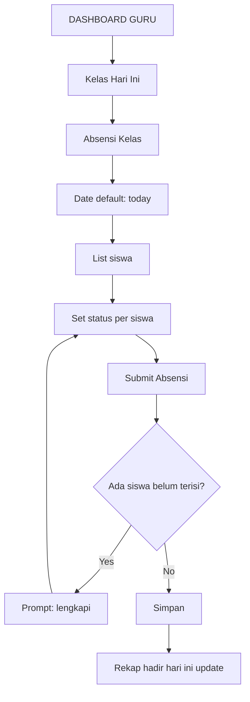

## 5) **Flow Guru: Absensi Harian**

```mermaid
flowchart TD
  A[DASHBOARD GURU] --> B[Kelas Hari Ini]
  B --> C[Absensi Kelas]
  C --> D[Date default: today]
  D --> E[List siswa]
  E --> F[Set status per siswa]
  F --> G[Submit Absensi]

  G --> H{Ada siswa belum terisi?}
  H -- Yes --> I[Prompt: lengkapi]
  I --> F
  H -- No --> J[Simpan]
  J --> K[Rekap hadir hari ini update]
```