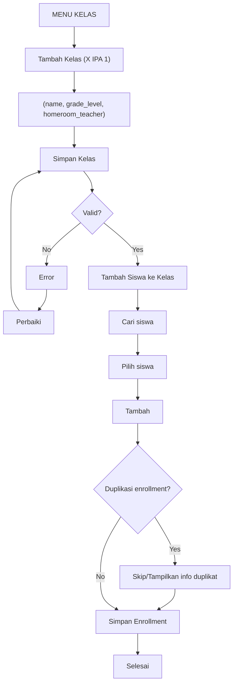

## **Flow Admin: Buat Kelas (Rombel) & Enroll Siswa**

```mermaid
graph TD
    A["MENU KELAS"] --> B["Tambah Kelas (X IPA 1)"]
    B --> C["(name, grade_level, homeroom_teacher)"]
    C --> D["Simpan Kelas"]
    D --> E{"Valid?"}
    E -->|"No"| F["Error"]
    F --> G["Perbaiki"]
    G --> D
    E -->|"Yes"| H["Tambah Siswa ke Kelas"]
    H --> I["Cari siswa"]
    I --> J["Pilih siswa"]
    J --> K["Tambah"]
    K --> L{"Duplikasi enrollment?"}
    L -->|"Yes"| M["Skip/Tampilkan info duplikat"]
    M --> N["Simpan Enrollment"]
    L -->|"No"| N
    N --> O["Selesai"]
```

***