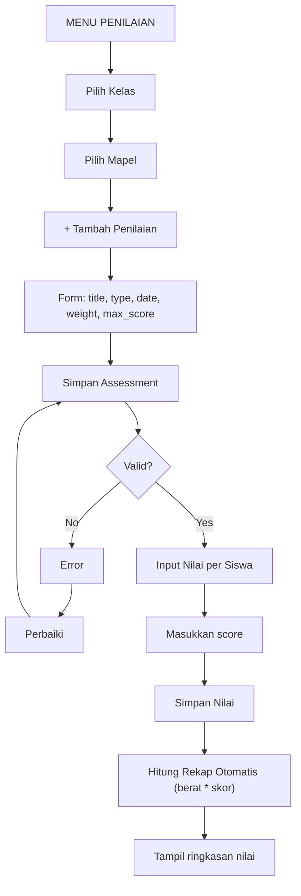

## 6) **Flow Guru: Buat Penilaian & Input Nilai**

```mermaid
graph TD
    A[MENU PENILAIAN] --> B[Pilih Kelas]
    B --> C[Pilih Mapel]
    C --> D[+ Tambah Penilaian]
    D --> E["Form: title, type, date, weight, max_score"]
    E --> F[Simpan Assessment]
    F --> G{Valid?}
    G -->|No| H[Error]
    H --> I[Perbaiki]
    I --> F
    G -->|Yes| J[Input Nilai per Siswa]
    J --> K[Masukkan score]
    K --> L[Simpan Nilai]
    L --> M["Hitung Rekap Otomatis (berat * skor)"]
    M --> N[Tampil ringkasan nilai]
```
