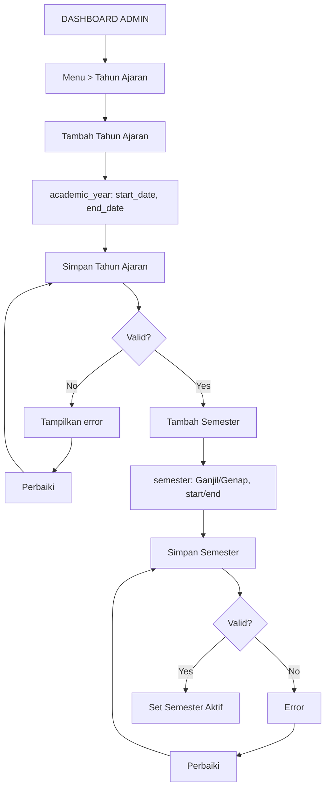

**Flow Admin: Setup Tahun Ajaran & Semester**

```mermaid
flowchart TD
  A[DASHBOARD ADMIN]
  B[Menu > Tahun Ajaran]
  C[Tambah Tahun Ajaran]
  D[academic_year: start_date, end_date]
  E[Simpan Tahun Ajaran]
  F{Valid?}
  G[Tampilkan error]
  H[Perbaiki]
  I[Tambah Semester]
  J[semester: Ganjil/Genap, start/end]
  K[Simpan Semester]
  L{Valid?}
  M[Error]
  N[Perbaiki]
  O[Set Semester Aktif]

  A --> B
  B --> C
  C --> D
  D --> E
  E --> F
  F -- No --> G
  G --> H
  H --> E
  F -- Yes --> I
  I --> J
  J --> K
  K --> L
  L -- No --> M
  M --> N
  N --> K
  L -- Yes --> O
```
