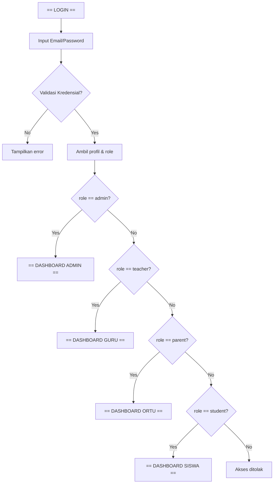

**Flow Login & Routing per Role**

```mermaid

graph TD
    A[== LOGIN ==]
    B[Input Email/Password]
    C{Validasi Kredensial?}
    D[Tampilkan error]
    E[Ambil profil & role]
    F{role == admin?}
    G[== DASHBOARD ADMIN ==]
    H{role == teacher?}
    I[== DASHBOARD GURU ==]
    J{role == parent?}
    K[== DASHBOARD ORTU ==]
    L{role == student?}
    M[== DASHBOARD SISWA ==]
    N[Akses ditolak]

    A --> B
    B --> C
    C -->|No| D
    C -->|Yes| E
    E --> F
    F -->|Yes| G
    F -->|No| H
    H -->|Yes| I
    H -->|No| J
    J -->|Yes| K
    J -->|No| L
    L -->|Yes| M
    L -->|No| N
```
